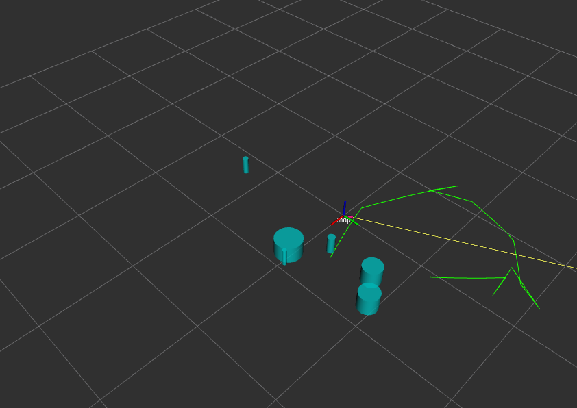
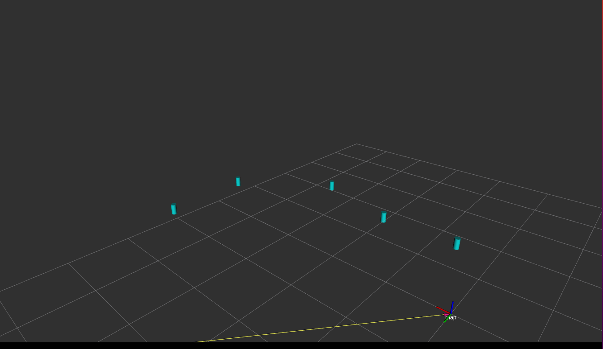
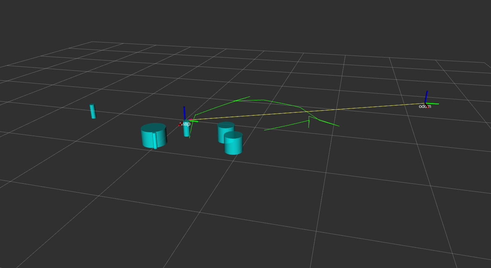
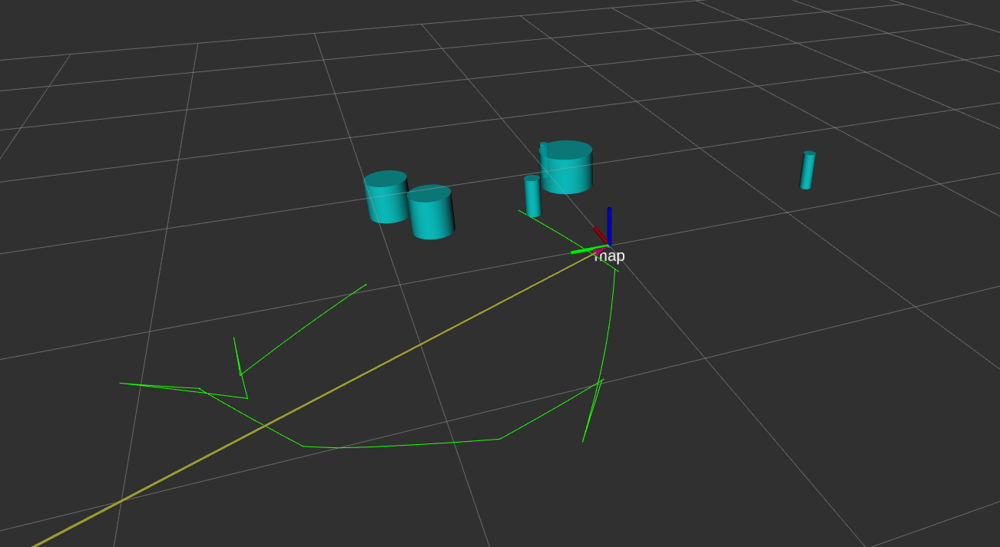

# ekf_slam
This repository implements an Extended Kalman Filter (EKF) based SLAM system for mobile robots. The system estimates the robot’s trajectory and landmark positions simultaneously while handling uncertainty in sensor measurements and motion. Data association resolved using a simple technique to differentiate landmarks using their radius.
## Results

