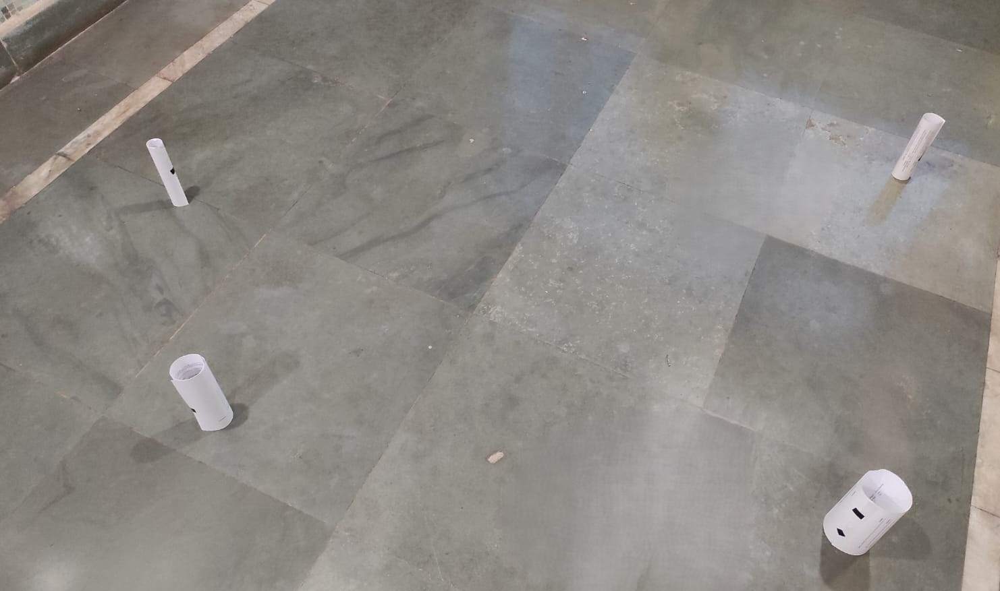
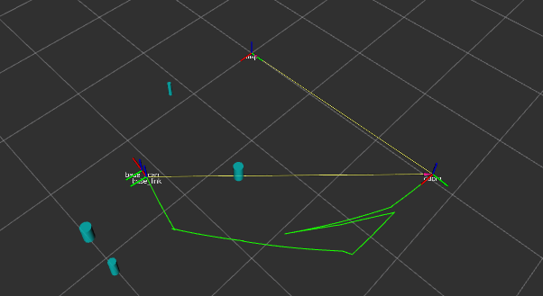

# EKF SLAM for Mobile Robots

---

## 1. Overview
This repository provides a ROS implementation of an Extended Kalman Filter (EKF) based SLAM system. The system is designed for a mobile robot equipped with sensors to detect environmental landmarks. It simultaneously estimates the robot’s trajectory (pose) and the positions of unknown landmarks while correctly handling the inherent uncertainty in sensor measurements and robot motion. Data association, the challenge of matching observed landmarks to previously mapped ones, is resolved using a simple technique that differentiates landmarks based on their radius.

---

## 2. Demonstration Video 🎥

[**Demonstration video.**](https://drive.google.com/file/d/13zRV44m3_bD5fZ9QBvfGtA95J0UB2IQw/view?usp=drive_link)

---

## 3. Results

.jpg)


.png)

---

## 4. Features
* **EKF-SLAM Core:** Implements the classic Extended Kalman Filter algorithm for simultaneous localization and mapping.
* **State Estimation:** The filter's state vector includes the robot's pose ($x, y, \theta$) and the coordinates of all observed landmarks ($L_{1x}, L_{1y}, L_{2x}, L_{2y}, ...$).
* **Uncertainty Propagation:** Correctly manages and propagates uncertainty using covariance matrices for both the prediction and update steps.
* **Data Association:** Includes a straightforward method for landmark matching based on size (radius).
* **Rich Visualization:** Comes with a pre-configured RViz setup to visualize:
    * The robot's estimated trajectory.
    * The estimated positions of landmarks with covariance ellipses representing their uncertainty.
    * The robot's coordinate frame (TF).

---

## 5. System Architecture
The project is encapsulated within a single ROS node for clarity and ease of use. It subscribes to sensor and odometry data and publishes the resulting map and pose estimates.

### ROS Interface
* **Subscribed Topics:**
    * `/odom` (`nav_msgs/msg/Odometry`): Provides the robot's motion information (used in the EKF prediction step).
    * `/scan` (`sensor_msgs/msg/LaserScan`): Provides sensor data used to detect landmarks.
* **Published Topics:**
    * `/tf` (`tf2_msgs/msg/TFMessage`): Broadcasts the transformation from the map frame to the odometry frame, correcting for odometry drift.
    * `/landmarks` (`visualization_msgs/msg/MarkerArray`): Publishes the estimated landmark positions and their uncertainty ellipses for visualization in RViz.

---

## 6. Core Algorithms

### 6.1. Extended Kalman Filter (EKF)
The EKF is the heart of this SLAM system. It operates in a two-step loop:

1.  **Prediction:** The robot's motion model (from odometry) is used to predict its new pose. This step also increases the uncertainty in the system, as motion is never perfectly accurate. The prediction is linearized using a **Jacobian matrix ($F_x$)** of the motion model.

2.  **Update:** When a landmark is observed, the system calculates a predicted observation based on the robot's current estimated pose. The difference between the real observation and the predicted one (the innovation) is used to correct the state (both robot pose and landmark positions). This step reduces the system's uncertainty. This correction is governed by the **Kalman Gain**, which is calculated using a **Jacobian matrix ($H_x$)** of the sensor model.

### 6.2. Data Association
Before the EKF update step can be performed, the system must determine if an observed landmark is a new one or one that has been seen before. This implementation uses a simple method where landmarks are identified by a physical property (their radius), allowing for straightforward matching of incoming sensor detections to landmarks already in the map.

---

## 7. Setup and Execution

### 7.1. Prerequisites
* Ubuntu 20.04 with ROS Noetic Ninjemys.
* Gazebo and TurtleBot3 simulation packages:
    ```bash
    sudo apt install ros-noetic-turtlebot3-gazebo
    ```

### 7.2. Build Instructions
1.  Clone this repository into your Catkin workspace's `src` directory.
    ```bash
    cd ~/catkin_ws/src
    git clone [YOUR_REPOSITORY_URL]
    ```
2.  Navigate to the root of your workspace and build the package:
    ```bash
    cd ~/catkin_ws
    catkin_make
    ```

### 7.3. Execution
1.  Open a terminal and source your workspace:
    ```bash
    source ~/catkin_ws/devel/setup.bash
    ```
2.  Run the master launch file (you would create a launch file to start the simulation, RViz, and your EKF node):
    ```bash
    roslaunch ekf_slam slam.launch
    ```

---

## 8. Tuning
The performance of the EKF is highly dependent on the correct tuning of its noise covariance matrices, which are set as ROS parameters.

* **Process Noise Covariance ($Q$)**: This matrix represents the uncertainty in the robot's motion model. Increasing these values tells the filter to trust the odometry less. It should be tuned to match the actual noise characteristics of the robot's movement.
* **Measurement Noise Covariance ($R$)**: This matrix represents the uncertainty in the sensor measurements. Increasing these values tells the filter to trust the sensor readings less. It should be tuned based on the specifications and real-world performance of the sensor.

---

## 9. Improvements and Future Work
While this implementation provides a solid foundation for EKF-SLAM, several enhancements could be made for more robust performance.

* **Advanced Data Association:** Implement a more robust algorithm like **Nearest Neighbor with Mahalanobis Distance** to handle situations with many ambiguous landmarks.
* **Loop Closure:** Add a mechanism to recognize when the robot has returned to a previously visited area. A successful loop closure can dramatically reduce the accumulated error in the map.
* **Different Sensors:** Adapt the measurement model to work with other sensors, such as a 2D LiDAR for feature extraction or a camera for Visual SLAM.
* **Optimization:** For maps with a very large number of landmarks, the EKF covariance matrix can become computationally expensive to update. Techniques like Sparse Extended Information Filters (SEIFs) could be explored.
